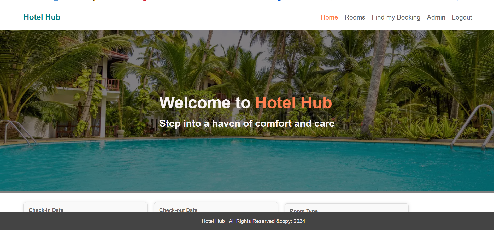
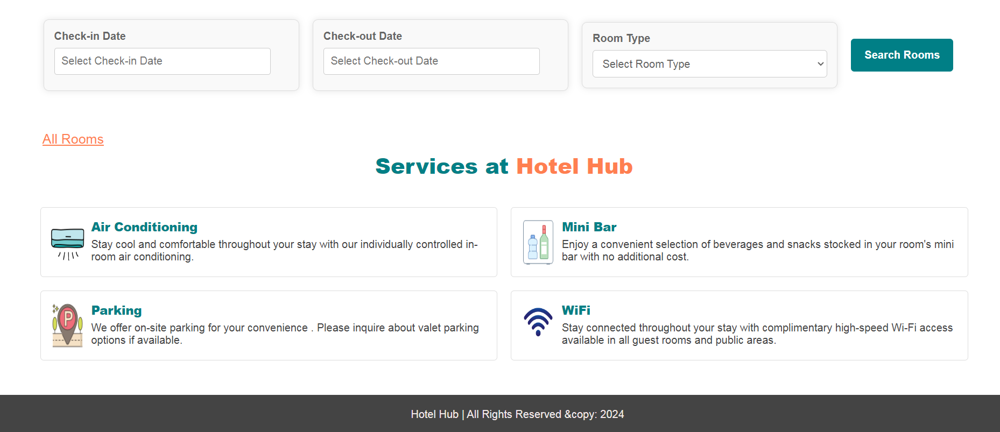
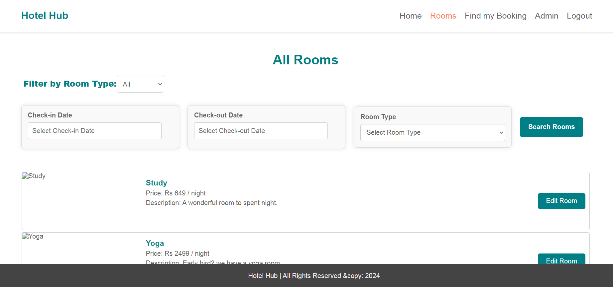
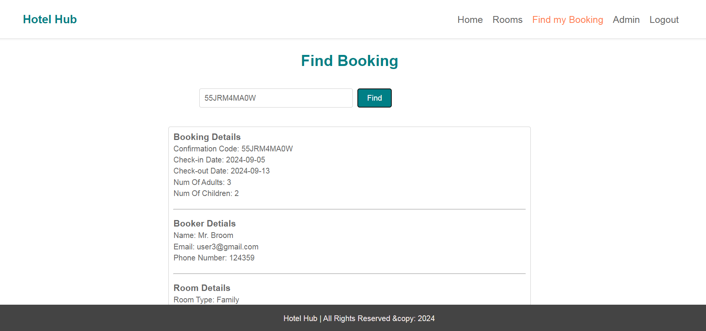
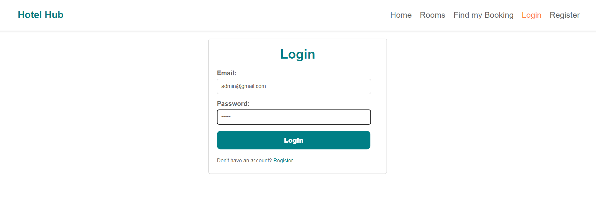
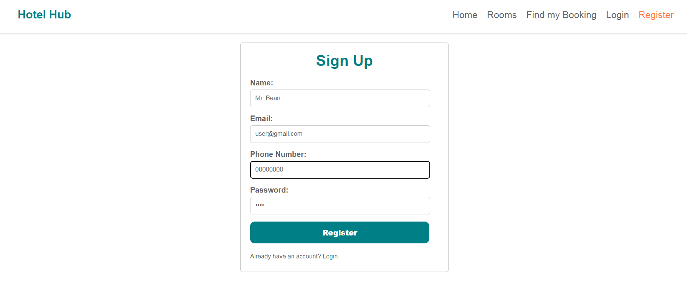
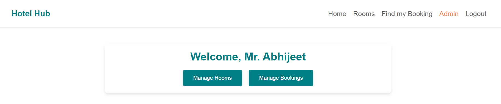

# Hotel Hub - Frontend

This is the frontend of **Hotel Hub**, a hotel booking web application. The frontend is built using React and provides a user interface for browsing hotels, booking rooms, and managing accounts for both users and admins.

## Features

- **Home Page**: Displays a list of available hotels.
- **Login/Signup**: Users can create accounts and log in using JWT-based authentication.
- **Hotel Booking**: Logged-in users can book hotel rooms.
- **User Profile**: Users can view and update their profile.
- **Admin Panel**: Admins can manage hotels, users, and bookings from the UI.

## Tech Stack

- **React**: For building the user interface.
- **React Router**: For navigation between pages.
- **Axios**: For making HTTP requests to the backend.
- **Bootstrap**: For styling and layout.
- **JWT**: Used for handling user authentication.

## Setup Instructions

### Prerequisites

- Node.js and npm installed

### Steps to run

1. Clone the repository:
    ```bash
    git clone https://github.com/yourusername/hotel-hub.git
    cd hotel-hub/frontend
    ```

2. Install the dependencies:
    ```bash
    npm install
    ```

3. Start the development server:
    ```bash
    npm start
    ```

4. The frontend will be running on `http://localhost:3000`.

## Usage

- **Login/Register**: Users can sign up or log in to access the hotel booking system.
- **Browse Hotels**: Users can browse available hotels on the home page.
- **Book a Hotel**: After logging in, users can select a hotel, view details, and book rooms.
- **Admin Access**: Admins can log in and manage hotels, rooms, users, and bookings through the admin panel.

## Folder Structure

- `src/components/`: Contains React components like forms, hotel listings, and admin panels.
- `src/pages/`: Contains different pages like Home, Login, Register, Admin Dashboard.
- `src/services/`: Contains services for making API requests to the backend.

## Screenshots

- **Home Page**:
    

- **Services**:
    

- **Room Page**:
    

- **Find Booking**:
    

- **Login Page**
    

- **Register Page**
    

- **Admin Dashboard**:
    

---

## License

This project is licensed under the MIT License.
